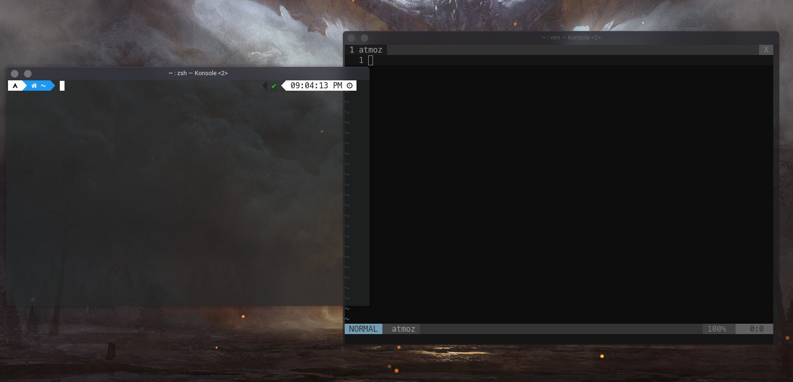

        ▓█████▄  ▒█████  ▄▄▄█████▓  █████▒██▓ ██▓    ▓█████   ██████                
        ▒██▀ ██▌▒██▒  ██▒▓  ██▒ ▓▒▓██   ▒▓██▒▓██▒    ▓█   ▀ ▒██    ▒                
        ░██   █▌▒██░  ██▒▒ ▓██░ ▒░▒████ ░▒██▒▒██░    ▒███   ░ ▓██▄                  
        ░▓█▄   ▌▒██   ██░░ ▓██▓ ░ ░▓█▒  ░░██░▒██░    ▒▓█  ▄   ▒   ██▒               
        ░▒████▓ ░ ████▓▒░  ▒██▒ ░ ░▒█░   ░██░░██████▒░▒████▒▒██████▒▒               
         ▒▒▓  ▒ ░ ▒░▒░▒░   ▒ ░░    ▒ ░   ░▓  ░ ▒░▓  ░░░ ▒░ ░▒ ▒▓▒ ▒ ░               
         ░ ▒  ▒   ░ ▒ ▒░     ░     ░      ▒ ░░ ░ ▒  ░ ░ ░  ░░ ░▒  ░ ░               
         ░ ░  ░ ░ ░ ░ ▒    ░       ░ ░    ▒ ░  ░ ░      ░   ░  ░  ░                 
           ░        ░ ░                   ░      ░  ░   ░  ░      ░                 
         ░                                                                          
         ▄▄▄▄ ▓██   ██▓    ▄▄▄     ▄▄▄█████▓ ███▄ ▄███▓ ▒█████  ▒███████▒ ██ ▄█▀ ██▓
        ▓█████▄▒██  ██▒   ▒████▄   ▓  ██▒ ▓▒▓██▒▀█▀ ██▒▒██▒  ██▒▒ ▒ ▒ ▄▀░ ██▄█▒ ▓██▒
        ▒██▒ ▄██▒██ ██░   ▒██  ▀█▄ ▒ ▓██░ ▒░▓██    ▓██░▒██░  ██▒░ ▒ ▄▀▒░ ▓███▄░ ▒██▒
        ▒██░█▀  ░ ▐██▓░   ░██▄▄▄▄██░ ▓██▓ ░ ▒██    ▒██ ▒██   ██░  ▄▀▒   ░▓██ █▄ ░██░
        ░▓█  ▀█▓░ ██▒▓░    ▓█   ▓██▒ ▒██▒ ░ ▒██▒   ░██▒░ ████▓▒░▒███████▒▒██▒ █▄░██░
        ░▒▓███▀▒ ██▒▒▒     ▒▒   ▓▒█░ ▒ ░░   ░ ▒░   ░  ░░ ▒░▒░▒░ ░▒▒ ▓░▒░▒▒ ▒▒ ▓▒░▓  
        ▒░▒   ░▓██ ░▒░      ▒   ▒▒ ░   ░    ░  ░      ░  ░ ▒ ▒░ ░░▒ ▒ ░ ▒░ ░▒ ▒░ ▒ ░
         ░    ░▒ ▒ ░░       ░   ▒    ░      ░      ░   ░ ░ ░ ▒  ░ ░ ░ ░ ░░ ░░ ░  ▒ ░
         ░     ░ ░              ░  ░               ░       ░ ░    ░ ░    ░  ░    ░  
              ░░ ░                                              ░                   

# Dotfiles
This is my personal collection of configuration files.





This README shows how to install my customised dotfiles for Neovim, Doom Emacs and Zsh.


---
## Install

Type the following commands:

```
git clone https://github.com/atmozki/dotfiles.git
cd dotfiles
sh ./install.sh
```

## Dependencies

- [neovim](https://neovim.io/)
- [Emacs](https://www.gnu.org/software/emacs/)
- [Doom Emacs](https://github.com/doomemacs/doomemacs)
- [powerlevel10k](https://github.com/romkatv/powerlevel10k)
- [zsh-syntax-highlighting](https://github.com/zsh-users/zsh-syntax-highlighting)
- [zsh-autosuggestions](https://github.com/zsh-users/zsh-autosuggestions)

## Change Shell to Zsh

`chsh /bin/zsh`
